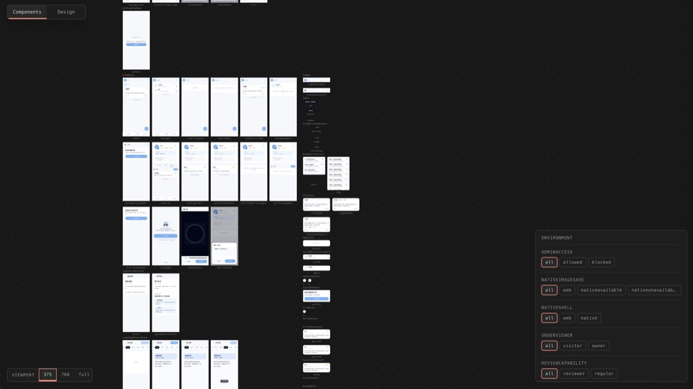
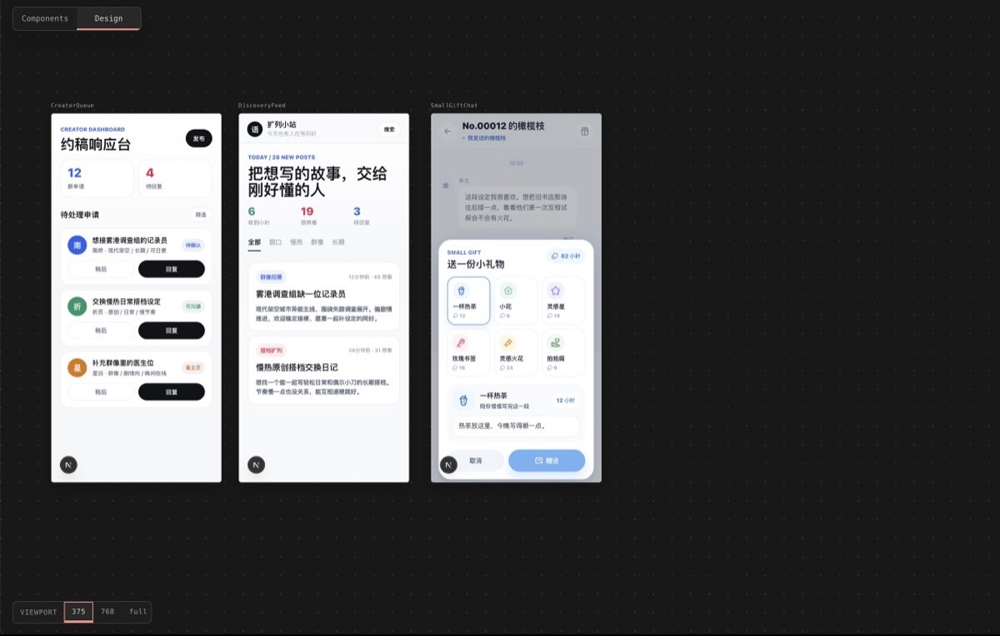
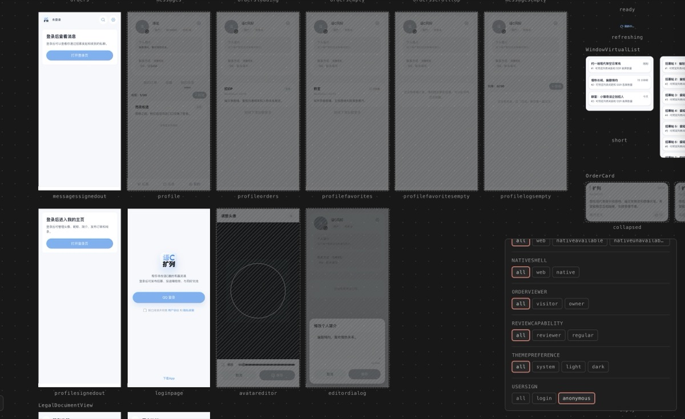

# Runelight

**The visual workspace for agent-built apps.**

Runelight is a GUI development workflow for the AI era. Your agent designs screens, builds components, and declares every visual state - typed and verifiable. You describe what you want, open `/runelight/studio`, and see the full picture. Design, build, and review in one workspace.



## Design

Explore directions before writing production code. Tell your agent "design a checkout flow" or "try three layouts for the settings page." It drafts visual frames in Studio's design workspace — you see them side by side, give feedback, iterate until the direction is right.

No mockup tool. No handoff. Design and production live in the same workspace.



## Build

Ask your agent to build the component or screen you want, the same way you would in any supported app: a user card, a settings panel, a checkout step. In a Runelight project, the implementation does not stop at the happy path. The agent keeps meaningful visual states beside the component as frames, and `runelight check` validates that reachable branches are represented.

For admin panels, role-specific views become provider variants. For pages that look different when data is empty or populated, those states become frames. They are visible in Studio without switching accounts or seeding databases.

## Review

Open `/runelight/studio`. Every component in your project, every visual state — rendered on one screen. Toggle filters to see how your UI responds across contexts: admin vs. regular user, signed-in vs. anonymous, empty vs. loaded.

No navigating your app. No clicking through flows. No test data. One URL.



Because every state is declared and type-checked, your agent can also verify its own work — catching visual drift before you even open Studio.

## Get Started — One Prompt

Paste this into your AI agent:

```
Install or upgrade Runelight in this project.

Fetch or refresh only this Runelight Agent Skill from
https://github.com/tuoxiansp/runelight:

- skills/setup-runelight

Install it as a project-level skill in this repository at `.agents/skills/setup-runelight`.
Do not install the full Runelight skill set globally.

After refreshing that setup skill, run `setup-runelight` in this project now. The setup
skill will detect this project's host and install only the needed project-level companion
skills, such as React or Vue authoring skills, into `.agents/skills`.
```

The agent detects your project (Vite React, Vite Vue, Next.js), installs packages, wires Studio, and verifies everything works. ~5 minutes.

Already have React components? Tell your agent to run the `refactor-to-runelight` skill after setup — it converts your existing TSX surfaces.

## Under the Hood

Runelight is built on the [`.g` protocol](docs/g-protocol.md) for modeling UI states. React uses `.g.tsx`: a normal React file with one static object appended. Vue uses `.g.vue`: a normal SFC with one `<g:frames>` custom block.

```tsx
import type { GFrames } from "@runelight/core"

type BadgeProps = {
  tone: "neutral" | "warning"
  label: string
}

export default function Badge(props: BadgeProps) {
  return <span data-tone={props.tone}>{props.label}</span>
}

Badge.frames = {
  neutral: { props: { tone: "neutral", label: "Ready" } },
  warning: { props: { tone: "warning", label: "Needs review" } },
} satisfies GFrames<BadgeProps>
```

That `.frames` object is the component-level footprint - inert data that never runs in production and never appears in your bundle. Your agent writes it. The type checker keeps it in sync.

Protocol types and helpers use the `G` prefix, such as `GFrames`, `createGScopeHook`, and `createGProvider`.

No preview wrappers in your components. No separate app shell to maintain. `@runelight/studio` ships as a prebuilt local Studio app, and the framework adapter serves it from your existing dev server at `/runelight/studio`.

### Leave Anytime

Rename `.g.tsx` → `.tsx` or `.g.vue` → `.vue`, delete frames, remove the Studio route. Plain app code. No lock-in.

## Docs

**Using Runelight:**

- [Authoring Guide](docs/runelight-authoring-guide.md) — patterns for pure, stateful, and contextual components
- [Refactor Guide](docs/runelight-refactor-guide.md) — convert existing TSX into Runelight format
- [Design Workspace](docs/runelight-design-workspace.md) — AI-assisted product design drafts in Studio

**Understanding Runelight:**

- [Design](docs/runelight-design.md) — architecture, sidecar model, and guarantees
- [.g Protocol](docs/g-protocol.md) — the source-level model behind frames, seams, and static checks
- [Static Contract](docs/runelight-static-contract.md) — the type-level contract, JSX branch coverage, and provider variant model

**For AI agents:**

- [Skills](skills/) — agent-executable workflows: [`setup-runelight`](skills/setup-runelight/SKILL.md), [`authoring-runelight-react`](skills/authoring-runelight-react/SKILL.md), [`authoring-runelight-vue`](skills/authoring-runelight-vue/SKILL.md), [`refactor-to-runelight`](skills/refactor-to-runelight/SKILL.md), [`design-runelight`](skills/design-runelight/SKILL.md)

## Contributing

pnpm workspace. `pnpm install && pnpm build && pnpm test && pnpm typecheck`.

Packages: `@runelight/core` (protocol, CLI), `@runelight/studio` (prebuilt Studio app and manifests), `@runelight/adapter-vite-react` (Vite React adapter), `@runelight/adapter-next-react` (Next.js adapter), and `@runelight/adapter-vite-vue` (Vite Vue adapter). Repository examples live under [`examples/`](examples/), including `react-vite` and `vue-vite`; agent-driven end-to-end goals live in [`intelligence-tests/`](intelligence-tests/).
