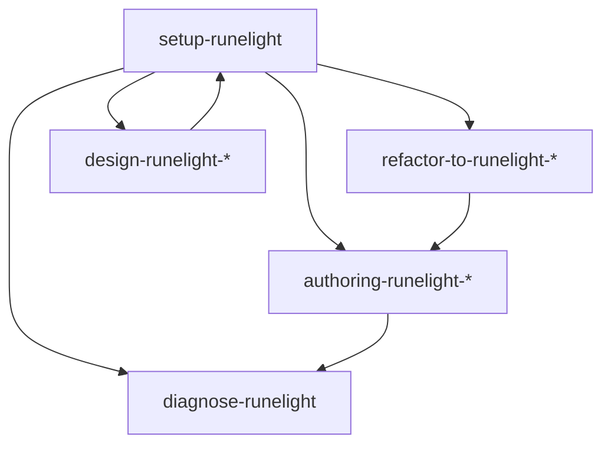

# Runelight Agent Skills

Executable workflows for AI agents integrating and authoring Runelight projects.

Skills are **installed by agents** (copied into `.agents/skills/` in the target project) — not via `npx skills add`. Installation is part of the [`setup-runelight`](./setup-runelight/SKILL.md) workflow so the agent can detect the Host, write glue code, and verify Studio.

## Quickstart

Paste the installer block from [README](../README.md#get-started--one-prompt), or copy `skills/setup-runelight` into `.agents/skills/setup-runelight` and run that skill.

## Skill map

| Skill | Use when |
|-------|----------|
| [setup-runelight](./setup-runelight/SKILL.md) | Install, upgrade, or repair integration |
| [authoring-runelight-react](./authoring-runelight-react/SKILL.md) | Write `.g.tsx` components |
| [authoring-runelight-vue](./authoring-runelight-vue/SKILL.md) | Write `.g.vue` components |
| [refactor-to-runelight-react](./refactor-to-runelight-react/SKILL.md) | Migrate React TSX → `.g.tsx` |
| [refactor-to-runelight-vue](./refactor-to-runelight-vue/SKILL.md) | Migrate Vue SFC → `.g.vue` |
| [design-runelight-react](./design-runelight-react/SKILL.md) | Studio design frames (React) |
| [design-runelight-vue](./design-runelight-vue/SKILL.md) | Studio design frames (Vue) |
| [diagnose-runelight](./diagnose-runelight/SKILL.md) | Studio/preview/config troubleshooting |
| [write-runelight-skill](./write-runelight-skill/SKILL.md) | Maintain skills in this repository |

Setup installs framework-specific companion skills only (React **or** Vue set, plus `diagnose-runelight`).

## Human documentation

Protocol and guides for readers: [`docs/`](../docs/). Skills are the agent source of truth for workflows; `docs/` explains concepts and links here for execution.

## Maintainer tools

| Path | Purpose |
|------|---------|
| [`.agents/skills/intelligence-test`](../.agents/skills/intelligence-test/SKILL.md) | Run `.it.md` E2E task cards |
| [`.agents/skills/write-intelligence-test`](../.agents/skills/write-intelligence-test/SKILL.md) | Author intelligence tests |
| [`intelligence-tests/`](../intelligence-tests/) | E2E outcome specifications |
