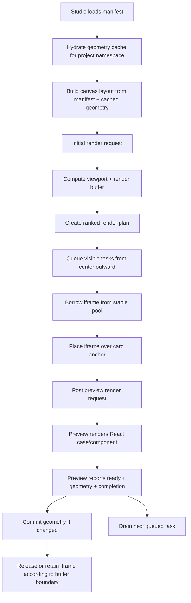

# Studio Canvas Performance Optimization Trace

Date: 2026-05-28

Scope: GTSX Studio canvas, yuckuolie Studio entry, preview iframe rendering, geometry cache, render queue, scroll/zoom interaction.

This trace records the performance and abstraction work done after the Studio canvas UX changes. It is meant as an engineering memory: what was broken, which abstractions were introduced, what decisions were made, how the behavior was verified, and what still deserves observation.

## Background

The Studio canvas was changed from a case-by-case right-sidebar workflow into a canvas-first workflow:

- Remove the right sidebar.
- Each UI component card displays all of that component's cases.
- A card should lay out cases with an attractive square-space-filling algorithm.
- Canvas zoom should be unified across cards.
- Highlighting targets the whole case collection/card, not each individual case.
- Highlight state must include drill-down path, because the same child can be reached from different parent paths.
- Preview rendering needs to be fast enough to feel close to a virtual list while scrolling.

The initial iframe-pool attempt exposed several bugs:

- Cards flickered and repeatedly showed preview loading text.
- Some cards never rendered after fast scrolling or viewport changes.
- `preview unavailable` appeared for some cases.
- Selection or panning triggered massive rerenders.
- The canvas transform sometimes jumped while cards were measuring/rendering.
- Pool debug dots were misleading because all cards looked green while the experience was not better than no-pool mode.

The final direction was to stop adding local fixes and instead split the system around clean boundaries:

- Canvas movement and geometry are one abstraction.
- Visibility and render intent are one abstraction.
- Render queue scheduling is one abstraction.
- Iframe lifetime and placement are one abstraction.
- Preview readiness/completion is one abstraction.
- Geometry cache hydration is an initialization phase, not a per-card async surprise.

## Main Root Causes

### 1. Iframe Reparenting Was Not Real Reuse

The early pool moved borrowed iframes into card containers. Reparenting iframe DOM nodes is expensive and can invalidate or reload the browsing context depending on browser behavior. This made the pool look active while still paying much of the cost that the pool was supposed to avoid.

The fix was to keep iframes mounted under a stable pool host and move them visually with fixed-position placement. Cards provide anchors; the pool positions iframes over those anchors.

### 2. Layout Measurement Bypassed the Render Request Model

The layout/measurement layer could force broad render activity and trigger notifications even when geometry had not meaningfully changed. That created rerender storms: one card finishing measurement could cause the whole canvas to rerender, then more cards would finish, multiplying the effect.

The fix was to make measurement commits idempotent and only notify when actual geometry/layout changed.

### 3. Buffer Rendering Starved Visible Rendering

The queue had the right idea, but some request phases pushed buffer work too early. In fast scroll scenarios, visible cards could wait behind buffer tasks. That produced the worst user-visible symptom: scrolling quickly to a blank region and waiting before anything appeared.

The fix was to separate request policy by phase:

- Visible tasks should be dispatched aggressively.
- Buffer tasks should be delayed while movement is active.
- Idle/stopped scroll phases can dispatch more work.
- Ranking must start from viewport center and then expand outward.

### 4. Geometry Cache Hydration Happened Too Late

When cached rect/size data was fetched asynchronously after canvas content already started rendering, cards could first lay out with estimated data and then jump when cache data arrived.

The fix was to make Studio initialize geometry cache up front for the manifest namespace. Once hydrated, canvas layout can synchronously read cached geometry.

### 5. Direct New-Iframe Target Experiment Was Worse

An experiment tried to render by direct target URLs/new iframes. It increased message volume and did not beat the stable pool design:

- Raw messages were roughly 2200 vs roughly 1500 in the pool path.
- Initial visual readiness was around 1.74s in the experiment.

That path was reverted. The clean pool abstraction remained the preferred direction.

## Landed Abstractions

### Stable Iframe Pool Host

Primary file:

- `packages/studio/src/components/preview-iframe-pool.tsx`

Responsibilities:

- Lazily create iframe instances.
- Reuse iframe instances through explicit borrow/release.
- Keep iframes under a stable pool host instead of reparenting into cards.
- Position borrowed iframes over card anchors.
- Expose debug state for whether a render used a pooled iframe or a newly-created iframe.

Conceptual boundary:

- The card does not own iframe DOM lifetime.
- The pool does not own render scheduling policy.
- The pool only answers: "given a render target, which iframe instance should display it, and where should it be placed?"

### Preview Render Request Clock

Primary file:

- `packages/studio/src/lib/studio-preview-render-request-clock.ts`

Responsibilities:

- Provide one consistent trigger function for initial render, movement render, idle render, completion-triggered render, and explicit refresh.
- Prevent every event source from having its own half-version of "schedule visible previews".

Important behavior:

- Initial Studio entry triggers rendering.
- Canvas scroll and zoom trigger rendering through rAF scheduling.
- Scroll/zoom stop triggers idle rendering through debounce.
- Completion of a render can trigger the next queue drain.

### Preview Render Request Policy

Primary file:

- `packages/studio/src/lib/studio-preview-render-request-policy.ts`

Responsibilities:

- Decide which previews are eligible for visible render, buffer render, and movement-time render.
- Keep "what should be rendered" separate from "how queue execution works".

Important behavior:

- Visible tasks are ranked from viewport center outward.
- Buffer tasks are ranked by distance from the current viewport and should favor the movement direction.
- Movement-time dispatch stays small so scrolling still gets visible response without flooding the browser.
- Idle dispatch can use larger concurrency.

### Render Plan, Render Sessions, and Completion Source

Primary files:

- `packages/studio/src/lib/studio-preview-render-plan.ts`
- `packages/studio/src/components/preview-render-session-store.tsx`
- `packages/studio/src/lib/studio-preview-render-completion-source.ts`

Responsibilities:

- Convert visible/buffer candidates into a stable render plan.
- Track render session state without forcing the entire canvas to rerender.
- Treat iframe completion as the true task-completion signal.

Important boundary:

- A queued task is not considered done just because it was dispatched.
- The task completes when the preview iframe reports the relevant render completion.

### Canvas Layout and Measurement Commit

Primary file:

- `packages/studio/src/hooks/use-studio-canvas-layout.ts`

Responsibilities:

- Maintain the component-card layout.
- Use cached geometry when available.
- Commit new measured geometry only when it really changes.
- Avoid global rerenders caused by redundant measurement writes.

Important behavior:

- Cached geometry should prevent refresh-time layout jumps for previously measured cards.
- Measuring one card should not cause unrelated cards to remount or rerender.

### Geometry Cache Store

Primary file:

- `packages/studio/src/lib/preview-geometry-cache-store.ts`

Responsibilities:

- Store preview geometry in IndexedDB.
- Namespace data by project/manifest identity.
- Use file/content hash-style validity so stale geometry can be ignored.
- Hydrate all available cache data during Studio initialization.

Important boundary:

- Browser-side IndexedDB is enough for Studio geometry cache.
- The preview iframe can report measured rect/size data back to Studio.
- Studio owns persistence and later synchronous cache reads.

### Preview Entry and Prehydration

Primary files:

- `packages/adapter-next-react/src/preview-route.ts`
- `packages/preview-react/src/index.tsx`
- `examples/yuckuolie/src/app/gtsx/page.tsx`

Responsibilities:

- Keep user-project entry code small.
- Move reusable preview/studio wiring into GTSX packages.
- Support Studio static preview URLs.
- Preserve the yuckuolie Studio entry as a concrete integration target.

One test implication:

- The GTSX package SSR test was updated to expect `static=1` in Studio preview URLs, because Studio cards now use static preview URLs.

## Render Flow

## Key Decisions

### Keep One Case Collection Per Card

Rendering multiple cases inside one iframe was discussed as a possible optimization, but it has correctness hazards when cases use viewport-relative units like `vw` and `vh`.

Decision:

- Do not collapse many cases into one iframe as a default optimization.
- First make the iframe pool and scheduling model correct.

### Iframe Pool Must Be Pull-Based and Lazy

The pool should be a simple structure:

- Borrow when a preview is actually about to render.
- Lazily create if no reusable iframe is available.
- Release when the preview leaves the render buffer, not merely when it leaves the viewport.
- Keep creation and recycle points explicit.

### No Fallback Rendering Path

Fallbacks made failures harder to reason about. The preferred model is a single clean path with debug visibility.

### Render Buffer and Maximum Candidate Count Are Different Concepts

Two concepts were separated:

- Actual render region: viewport plus buffer. This determines what should be actively rendered/retained.
- Maximum render candidates: a safety cap for queue/planning. It can be large because queue maintenance is cheap and final execution rechecks current canvas state.

### Release Boundary Should Match Render Buffer

Iframe release should not happen immediately when a card leaves the viewport. If the card is still inside the render buffer, it should remain eligible/retained.

### Queue Tasks Must Revalidate at Execution Time

Scroll and zoom can make older tasks stale. The queue can keep tasks freely, but before a task executes it must compare against current canvas state and decide whether it still belongs to the active render region.

## Debug Instrumentation

Debug modes added during the work:

- Pool source indicator:
  - Green dot: render used a pooled iframe.
  - Orange dot: render created a new iframe.
- Visible-region task indicator:
  - Shows when a card/case is selected as a visible-area render task.
- Diffusion center indicator:
  - A short-lived dot appears when idle diffusion render starts, so the expansion center can be visually verified.
- Per-case render lifecycle indicator:
  - Helps inspect whether a case is queued, dispatched, accepted by preview, rendered, measured, and completed.

These indicators were added because the pool source alone was misleading: all-green did not prove the pool was improving user-perceived scroll response.

## URL / Runtime Knobs

Several behavior knobs were made configurable through URL/debug options during the tuning:

- Render throttle.
- Idle/debounce delay.
- Buffer size.
- Pool on/off debug switch.
- Maximum concurrent render tasks.
- Movement-time dispatch size.
- Idle/stopped-scroll dispatch size.

The important tuning direction:

- During active movement, dispatch a small number of visible tasks so blank regions start filling immediately.
- During idle, dispatch more aggressively so the buffer catches up.

## Verification

### Unit and Build Checks

Passing checks recorded during the final phase:

- `pnpm --filter @gtsx/studio test -- test/studio-client.test.tsx`
  - Passed 143 tests.
- `pnpm --filter @gtsx/studio build`
  - Passed.
  - Vite dynamic import warnings remained, but they were not new blockers.
- `pnpm --filter @gtsx/adapter-next-react test`
  - Passed 12 tests.
- `pnpm --filter @gtsx/adapter-next-react build`
  - Passed earlier in the run.
- `pnpm --filter @gtsx/preview-react build`
  - Passed.
- `pnpm --filter gtsx test`
  - Initially failed in sandbox because of listen/tsx IPC/Chromium permission errors.
  - Reran with escalation and passed 69 tests.

### Visual Probe Results

Final default behavior from the visible-scroll probe:

- Before fast scroll: `6/6` visible previews ready.
- Immediately after wheel sync: `12` visible previews loading.
- After 100ms: `7/12` ready, and in another run `9/12` ready.
- After 250ms: `12/12` ready.
- First visible completion after scroll response: about `165ms`.

Full audit final data:

- Initial first visible completion: about `808.9ms`.
- Deep-wheel first new visible count: `6`.
- Deep-wheel first visible completion: about `108ms`.
- Three-screen scroll first visible completion: about `63.4ms`.
- Final scroll response first visible completion: about `58.5ms`.
- Pool stats:
  - Created: `46`
  - Reused: `290`
  - Redelivered render posts: `0`
  - Active: `32`
  - Idle: `14`

These numbers moved the experience from "blank for several seconds after fast scroll" toward "visible cards begin filling in within one frame cluster and complete shortly after".

## Local Test Target

The yuckuolie Studio target used during verification:

- `http://127.0.0.1:4315/gtsx/studio`

Observed unrelated server warning:

- Database warning that `yuckuolie` database does not exist.
- This was not treated as part of the Studio canvas performance issue.

Temporary browser/probe scripts were placed in `/private/tmp`, for example:

- `/private/tmp/gtsx-studio-performance-audit.mjs`
- `/private/tmp/gtsx-studio-visible-scroll-probe.mjs`
- `/private/tmp/gtsx-studio-frame-state-probe.mjs`

These were investigation artifacts, not source files.

## Remaining Observation Points

The goal was marked complete after the last tuning pass, but the following areas are worth watching:

- Cold initial first visible completion is still around `800ms`; it may be acceptable, but it is the next obvious optimization target.
- Some repeated raw `ready` / `render-accepted` messages appeared during revisits. They did not block the final behavior, but they may point to virtualized revisit or pool eviction details.
- Exact-frame retention could become smarter so a nearby revisit is even less likely to need a fresh render post.
- A completion-aware buffer gate may eventually replace the fixed buffer delay. The current `1000ms` delay performed well in the measured fast-scroll scenarios.
- The macOS touchpad pinch center issue was observed intermittently; it should remain on the regression checklist for canvas transform work.
- The final-card bottom sticky behavior was identified as undesirable and should stay covered by manual verification.

## Practical Regression Checklist

When touching this area again, verify these behaviors before considering the change safe:

- Refresh Studio: visible cards render without needing a manual scroll.
- Fast scroll from top to bottom: first visible cards begin rendering quickly, not after a long blank pause.
- Fast scroll to bottom and then back to middle: render priority follows the current viewport center.
- Repeated three-screen scrolls: cards do not rerender if they remain visible and their render inputs did not change.
- Slow scroll: iframe release follows the render buffer boundary, not the viewport boundary.
- Zoom with touchpad/mouse pointer: zoom center stays under the pointer.
- Selecting/highlighting a component: unrelated visible previews do not all flash or remount.
- Cached geometry after reload: previously measured cards should not visibly jump in size or layout.

## Summary

The main win was not a single micro-optimization. The work made the Studio canvas render pipeline easier to reason about:

- Geometry cache is initialized before layout.
- Canvas visibility produces render intent.
- Render policy ranks visible and buffer work.
- Queue execution is completion-aware and revalidates stale tasks.
- Iframe pooling is stable because iframes are no longer reparented.
- Debug overlays expose the lifecycle instead of hiding it behind "green means good".

This gives the next round of optimization a cleaner surface: if scroll response regresses, inspect request policy and queue execution; if flicker returns, inspect iframe ownership and session state; if layout jumps return, inspect geometry cache hydration and measurement commits.
